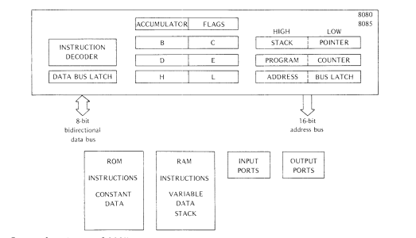
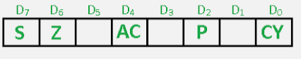
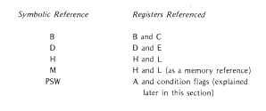
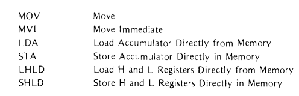
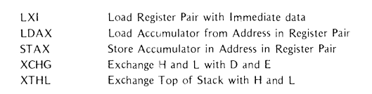
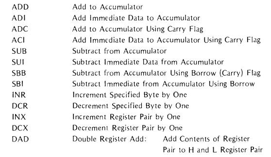
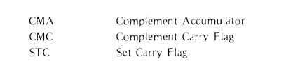
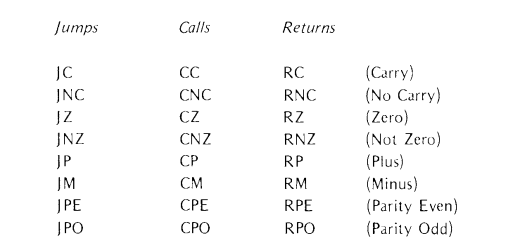
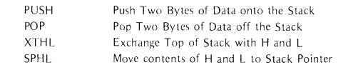

# Basics of 8085 Programming

Ashish Thapa


-----
# Essential Architecture for programming 



- Accumulator 
- Flag

- program counter
- Registers: BC , DE, M(HL)  


-----

# Addressing Modes 

- *Implied Addressing*  : `STC` deals with carry portion of flag register, `DAA` deals with accumulator
- *Register Addressing* : most of the time 8 bit values
`CMP E` ;compare accumulator and register E 
`MOV A, B` ; move contents of B on A
`PCHL`: program counter exchanges the content with H and L Register
- *Immediate Addressing* : Starts with I .i.e `MVI`, `ADI`, `CPI`
`MVI A, 12H`; move 12H to A 
`LXI D, 3423H`; load 3423 to D
- *Direct Addressing* : uses 16 bit addresss as part of instruction
		`JZ Carry`; jump to carry label if zero flag is on
- *Register Indirect Addressing*: usually has X to represent pairs
		`LDAX`, `STAX`

----

# Groups of Instructions
|||
|---|---|
| | Data transfer |

----

# Groups of Instructions

|||
|---|---|
|| Arithmetic|
| Complement and Carry Flag|

----

# Groups of Instructions

|||
|---|---|
|| Jump Call and Return|
||Stack Based|


----

# Assembly Basics

```asm
Label: Opcode Operand ; comment
```

### Supported Operand 
- Hexadecimal :  `20H`
- Decimal :  `32D`
- Binary :  `20B`
- location counter : `$+6`


----

# Assembly Basics

```asm

STC ;set carry flag

MVI A, 12H ;immediate addressing. Move 12H to A
DAA ;convert to BCD Decimal

MVI E, 123
CMP E ; compare Accumulator and the register E

;LXI H, 0809H 
;PCHL ; pgoram counter will store whatever is on HL

LXI H, 1323H
SHLD 0021H ;store HL contents on location 0021
MVI H, 33H; modify H
LHLD 0021H ; load content from 0021H to HL

DATA: DB 12H,13H, 23H
LXI D, DATA

```

----
# Add , Subtract and Multiply

##### Add
```asm
MVI B , 10 ; move 10 to B
MVI C , 20 ; move 20 to C
MOV A, B; move B to accumulator as ALU operation is generally done in Accumulator
ADD C ; Add C to accumulator content making it 30 or 1EH
```

##### Subtract
```asm
MVI A, 13 ; move 13 to A
SBI 4 ; subtract
```

##### Multiply ( Repetitive Addition )

```
; we want to multiply 6 * 5 
MVI B, 6 ; move 6 to B
MVI C, 5 ; move 5 to C
MOV D, C ; move contents of B to D
mul: MOV A, C ; move contents of C to A
ADD D ;add D + A;  x + 5 
MOV C, A; move contents of accumulator on C
DCR B; decrement B
MOV A, B ; move B to accumulator
CPI 01H
JP mul; if B is not 0 then keep looping
```

<style scoped>
* {
		font-size: 15px;
 }
</style>

----

# Assembly Basics

### if else
```asm
; if else equivalent
; if a > b
MVI A, 67D ; move 67 to A
MVI B, 51D ; move 51 to B
CMP B ; compare A and B; basically A - B
JM else ; if result is minus then go to JMP label
MVI A, 1; will be visited if only result A-B is positive
JMP ol ; we don't want to run else content so we jump to ol
else: MVI A, 0
ol: nop
```

----
### while loop 

```asm
;a = 1; while c > 3  { a +=1; c-=1 } 
MVI C, 3 
MVI A, 1

loop: MOV A, D
ADI 1
MOV D, A
DCR C
MOV A, C
JNZ loop

```


