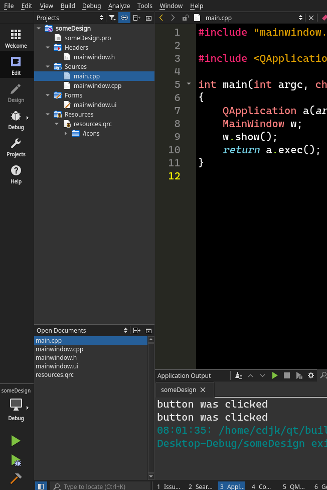
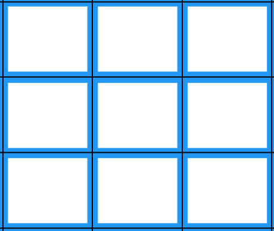
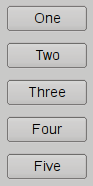
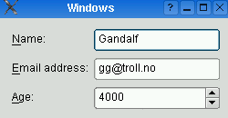

# Workshop on QT 


Ashish Thapa
github.com/voidash

-----
# Setting Up

- QString  , QList, QMap
- Multithreading
		- QThread
		- QSemaphore
		- QMutex
- How to import external libraries
- SQL basics
- Adding Resources
- QML and Declerative programming
- Responsive Layout

- gather HTTP resources using QT
- Parsing JSON with nlohman json
- Accessing file using QT
- Different approach to Build GUI apps in QT

----- 
# Setting up Qt and QtCreator

- Ensure you have C++ compiler (MSVC/mingw/clang)
- Download QT creator [qt.io/download](https://www.qt.io/download)
- For linux (Debian based) : `sudo apt install build-essential qt5-default qtcreator libqt5sql5-mysql`
- For linux (Arch based) : `sudo pacman -Sy base-devel qt5-base qt5-tools`

### To check if compiler is detected or not 
open QT creator > Tools (on Menu Bar) > Options > Kits > Compilers

<hr/>
Additional Resources

[How to install Qt Creator on windows 10](https://www.youtube.com/watch?v=hQSuM1uCdXE)

-----


# Essential Concepts 

|||
|--------|-----------------------|
|Pointers |  |
| Macros | |
| Observer Design Pattern | |

----

# QT Hello World

<style scoped>
* {
	font-size: 20px;
}
</style>
```c++
main.cpp

#include <QApplication>
#include <QLabel>
int main(int argc, char *argv[])
{
	QApplication app(argc, argv);
	QLabel label("Hello world !");
	label.setStyleSheet("QLabel:hover {color: red}");
	label.show();
	return app.exec();
}
```

```python
project.pro

TEMPLATE = app  #might be lib, plugin
TARGET = QTHelloWorld #final output
INCLUDEPATH += . #include whatever is in this current folder
QT += widgets
# += *= -=  
SOURCES += main.cpp
```

----


# QT Creator

```
Shortcuts
Ctrl+o : open file
Ctrl+n : New file
Ctrl+k : Activate Locator 
Ctrl+2 : Edit Mode
Ctrl+4 : Debug Mode
ctrl+r : run project
ctrl+b : build project
```

```
To change Theme
Tools(Menu bar) > Options > Environment > Interface > Theme > Flat

To change color scheme
Tools(Menu bar) > Options > Text Editor > Fonts & Colors > Color Scheme > My own scheme

Vim Mode
Tools(Menu bar) > Options > FakeVim > use FakeVim
```
<hr/>

[Keyboard Shortcuts For QT creator](https://doc.qt.io/qtcreator/creator-keyboard-shortcuts.html)

---- 

### QT Creator (Is it fully fledged C++ IDE) 



- QT projects are possible with either Cmake or QMake
- C++ Libraries and plain c++ application are also possible 
- Has support for Debugging 
- Code formatting and linting with clang-format and clang-tidy 

----
<style scoped>
	* {
			font-size: 12px;
	 }
</style>

## Layouts

|layout|image|description|
|--------|-----------------------|--------|
|GridLayout |  |`addWidget(widgetName, row, column , rowSpan, columnSpan)`|
|QVBoxLayout  | |`addWidget(widgetName)`|
|QHBoxLayout | |`addWidget(widgetName)`|
|FormLayout | |` addRow(widgetName); labelForField(fieldWidgetName)`|
<hr/>
Resources

[QT different Layouts](https://doc.qt.io/qt-5/layout.html)

----


# QT Resources

- [Awemsome QT](https://github.com/JesseTG/awesome-qt)

