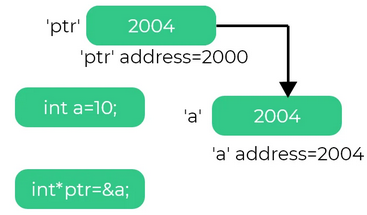

# Workshop on QT 


Ashish Thapa
github.com/voidash
twitter.com/voidash_
at54021319@student.com.np

----- 
<style scoped>
details {
	font-size: 15px;
}
pre {
line-height:0.5;
}
</style>
### Download Code for the workshop here 

# [programs.zip](./programs.zip)

<details>
<summary>Click to view zip file tree</summary>
<pre>

├── EssentialConcepts
│   ├── complex_num.cpp
│   ├── lambda.cpp
│   ├── macros.cpp
│   ├── observerModel.cpp
│   └── pointer_good_example.cpp
├── QMake
│   └── QMake.pro
├── QTcreator
│   ├── DifferentLayouts
│   ├── QtMiscUtils
│   └── RoutineManagement
└── QTHelloWorld
    ├── main.cpp
    └── QTHelloWorld.pro
</pre>
</details>

-----

### Programs going to be discussed 

<style scoped>
	* {
			font-size: 15px;
}
</style>
||||
|----|-----|----|
Essential Concepts| |showcases small programs related pointers, lambda functions, macros , observer Design pattern|
Basic Layouts| |shows how procedural QT works by creating different layouts|
QT Console App| |shows use of core classes such asQString, QList, QRegExp works |
Routine Management System| | interface with database by fetching data into table and performing CRUD operations on table|
QMake Basics| |Shows basic use of QMake|

-----
# Setting up Qt and QtCreator

- Ensure you have C++ compiler (MSVC/mingw/clang)
- Download QT creator [qt.io/download](https://www.qt.io/download)
- For linux (Debian based) : `sudo apt install build-essential qt5-default qtcreator libqt5sql5-mysql`
- For linux (Arch based) : `sudo pacman -Sy base-devel qt5-base qt5-tools`

### To check if compiler is detected or not 
open QT creator > Tools (on Menu Bar) > Options > Kits > Compilers

<hr/>
Additional Resources

[How to install Qt Creator on windows 10](https://www.youtube.com/watch?v=hQSuM1uCdXE)

-----


# Essential Concepts 

|||
|--------|-----------------------|
|Pointers |  |
| Macros & Lambda Functions|`[=]() {std::cout << "this is lambda function " << std::endl;}`|
| Observer Design Pattern | |

----

# QT Hello World

<style scoped>
* {
	font-size: 20px;
}
</style>
```c++
main.cpp

#include <QApplication>
#include <QLabel>
int main(int argc, char *argv[])
{
	QApplication app(argc, argv);
	QLabel label("Hello world !");
	label.setStyleSheet("QLabel:hover {color: red}");
	label.show();
	return app.exec();
}
```

```python
project.pro

TEMPLATE = app  #might be lib, plugin
TARGET = QTHelloWorld #final output
INCLUDEPATH += . #include whatever is in this current folder
QT += widgets
 # += *= -=  
SOURCES += main.cpp
```

----


# QT Creator

```
Shortcuts
Ctrl+o : open file
Ctrl+n : New file
Ctrl+k : Activate Locator 
Ctrl+2 : Edit Mode
Ctrl+4 : Debug Mode
ctrl+r : run project
ctrl+b : build project
```

```
To change Theme
Tools(Menu bar) > Options > Environment > Interface > Theme > Flat

To change color scheme
Tools(Menu bar) > Options > Text Editor > Fonts & Colors > Color Scheme > My own scheme

Vim Mode
Tools(Menu bar) > Options > FakeVim > use FakeVim
```
<hr/>

[Keyboard Shortcuts For QT creator](https://doc.qt.io/qtcreator/creator-keyboard-shortcuts.html)

---- 

### QT Creator (Is it fully fledged C++ IDE) 


- QT projects are possible with either Cmake or QMake
- C++ Libraries and plain c++ application are also possible 
- Has support for Debugging 
- Code formatting and linting with clang-format and clang-tidy 

----
<style scoped>
	* {
			font-size: 12px;
	 }
	 h1 { 
		 font-size: 30px;
	 }
</style>

# QT Layouts

|layout|image|description|
|--------|-----------------------|--------|
|GridLayout |  |`addWidget(widgetName, row, column , rowSpan, columnSpan)`|
|QVBoxLayout  | |`addWidget(widgetName)`|
|QHBoxLayout | |`addWidget(widgetName)`|
|FormLayout | |` addRow(widgetName); labelForField(fieldWidgetName)`|
<hr/>
Resources

[QT different Layouts](https://doc.qt.io/qt-5/layout.html)

----

# Demystifying Layouts and Widgets  


----

# Using QT Designer    

<style scoped>
ul {
 font-size: 13px;
}
pre {
	font-size: 10px;
}
</style>
- What MOC (Meta Object Compiler) is ?

```c++
class MyClass : public QObject
{
    Q_OBJECT // MOC

public:
    MyClass(QObject *parent = 0);
    ~MyClass();

signals:
    void mySignal();

public slots:
    void mySlot();
};
```

- `Q_OBJECT` macro is replaced with c++ source file that contains meta-object code for those classes by **MOC**. Meta object code is required for the signals and slots mechanism. 
- To Build a responsive layout , the top parent must be laid in **GridLayout**.  And always select frame then later convert to Column layout, or horizontal layout depending upon your need. 
- For every `QMainWindow` child generated by `add new > Qt > Qt Designer Form (with .ui extension) `, there is a private member variable `Ui::MainWindow *ui` which can be used to access various components such as `LineEdit`, `QTableWidget` etc
```c++
std::cout << ui->lineEdit->text().toStdString() << std::endl;
```
----

# QT Designer Contd...

- To add global stylesheet, right click the main parent and change stylesheet.
- click on main project root then `add New > Qt > Qt Resource File` to add images 
----

### Creating MySQL database online with Clever Cloud 
<iframe width="560" height="315" src="https://www.youtube.com/embed/cjkksEmH9Ig" title="YouTube video player" frameborder="0" allow="accelerometer; autoplay; clipboard-write; encrypted-media; gyroscope; picture-in-picture" allowfullscreen></iframe>

### Hosting MySQL instance locally with Xampp

<iframe width="560" height="315" src="https://www.youtube.com/embed/-f8N4FEQWyY" title="YouTube video player" frameborder="0" allow="accelerometer; autoplay; clipboard-write; encrypted-media; gyroscope; picture-in-picture" allowfullscreen></iframe>

----

# SQL Commands 

<style scoped>
	* {
		font-size: 15px;
	 }
</style>
- To create Database
```sql
CREATE DATABASE contact_db;
```

- To create table
```sql
CREATE TABLE IF NOT EXISTS routine(
	id int AUTO_INCREMENT primary key,
	instructor varchar(30),
	time_period time,
week varchar(10)
);
```

- To insert into table
```sql
INSERT INTO Routine(id, instructor, time_period, w_week) 
values (1, "Gajendra Sharma", "12:00:00", "Sunday");
```

- update values in table

```sql
UPDATE `Routine` 
set time_period = "2:00:00"
where id = 1;
```

- delete row from table

```sql
DELETE FROM `Routine` where id = 1;
```

----

<style scoped>
	* {
		font-size: 15px;
	 }
</style>
# QTSql


- on your project (.pro) file add
```
QT += SQL
```

- To connect to database
```c++
#include <QtSql>

// If MySQL : QMYSQL
// If Postgresql : QPSQL
// If Sqlite : QSQLITE
QSqlDatabase db_conn = QSqlDatabase::addDatabase("QMYSQL"); // MYSQL in this example
    db_conn.setHostName("database-awesome.cc195vywqlyq.ap-south-1.rds.amazonaws.com");
    db_conn.setDatabaseName("contact_db");
    db_conn.setUserName("admin");
    db_conn.setPassword(PASSWORD);
    db_conn.setPort(3306);
```

----

# QTSql contd
<style scoped>
	* {
		font-size: 15px;
	 }
</style>

- FETCH OPERATION USING QT SQL 
```c++
        QSqlQuery statement("SELECT * FROM Routine",db_conn);
        QSqlRecord record = statement.record();

        std::cout << record.count() <<std::endl;
        while(statement.next()) {
            auto instructor = statement.value(record.indexOf("instructor")).toString();
            auto time_period = statement.value(record.indexOf("time_period")).toString();
            auto w_week = statement.value(record.indexOf("w_week")).toString();
            auto course_code = statement.value(record.indexOf("course_code")).toString();
        }
```

- INSERT OPERATION USING QTSQL

```c++
	QSqlQuery ins_statement(db_conn);
	ins_statement.prepare("INSERT INTO Routine (instructor,course_code, time_period, w_week)" "VALUES(?, ?, ?, ?)");
	ins_statement.addBindValue(ui->instructor->text());
	ins_statement.addBindValue(ui->courseCode->text());
	ins_statement.addBindValue(ui->timePeriod->text());
	ins_statement.addBindValue(ui->week->text());
	ins_statement.exec();
```

---- 
# QTSQL contd

- Delete a record
```c++
	// Delete a record
QSqlQuery delete_statement(db_conn);
delete_statement.exec("DELETE FROM Routine WHERE instructor = 'Prakash Paudel'");

// how many rows were affected
qDebug() << "Number of rows affected: " << delete_statement.numRowsAffected();
```

- Update a record
```c++
// Update a record
QSqlQuery update_statement(db_conn);
update_statement.exec("UPDATE contacts SET instructor='Gajendra Sharma' WHERE id=2 ");
qDebug() << "Number of rows affected: " << update_statement.numRowsAffected();
```

----
<style scoped>
blockquote {
	font-size: 10px;
}
pre {
	font-size: 10px;
}

ul {
	font-size: 15px;
}
</style>
# QT Core C++ Classes  (QString, QRegExp , QMap)

> Note: if qDebug is not working then 
> Qt creator > Tools > Options > Kits, select your kit, find Environment, click change and add `QT_ASSUME_STDERR_HAS_CONSOLE=1`

- QString : integrates with Qt well than std::string
```c++
   QString name("Ashish Thapa");

   // std::cout << name << std::endl; error. You have to use qDebug 
   // to convert into std::string
   std::string standardName = name.toStdString();
   std::cout << standardName << std::endl;
   // QString formatting
   auto entry = QString("Best entryFragger: %1 ,Best Sentinel: %2, Best agent: %3").arg("Raze","Astra","Jett");
   
   qDebug() << entry;
```
- QRegExp: Regular expression in Qt 

```c++
#include <QRegExp>
// Basic QString Validator, checks whether the string is in hh:mm:ss
QRegExp rg(R"(^([0-1]?\d|2[0-3])(?::([0-5]?\d))?(?::([0-5]?\d))?$)");
qDebug() << "22:23:33 " <<  rg.exactMatch("22:23:33");
qDebug() << "42:23:33" << rg.exactMatch("42:23:33");
qDebug() << "23" << rg.exactMatch("23");
```

- QMap
```c++
    QMap<QString, int> map;
    map["one"] = 1;
    map["three"] = 3;
    map["seven"] = 7;
```

----
# Understanding Qmake in depth


<p>
The qmake tool helps simplify the build process for development projects across different platforms. It automates the generation of Makefiles so that only a few lines of information are needed to create each Makefile. You can use qmake for any software project, whether it is written with Qt or not.

qmake generates a Makefile based on the information in a project file. Project files are created by the developer, and are usually simple, but more sophisticated project files can be created for complex projects.
</p>

----
# Resources

- [Awemsome QT](https://github.com/JesseTG/awesome-qt)
- [inqlude](https://inqlude.org/) : libraries for Qt Toolkit. it has its own client to install libraries
- Download books from [z-lib.org](https://z-lib.org/)
	- [Learn Qt 5 Build modern, responsive cross-platform desktop applications with Qt, C++, and QML (Nicholas Sherriff (Nick))]()
	- [Application Development with QT Creator]()


