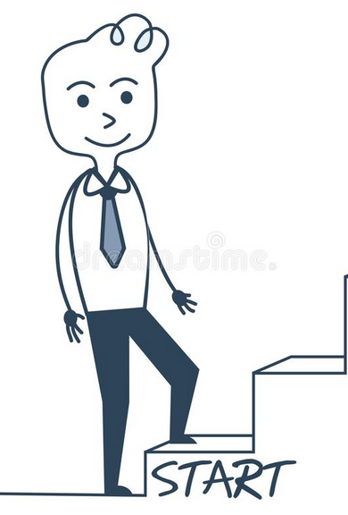

# Teaching a Technical Concept to someone that has never heard of it

------

## First phase

- comparision 
- Start with Prerequisites 
- if there are suitable analogies then talk about it

------
## Second phase

- Simple explanation. Feynman approach where jargons are replaced by its meaning.  
- If here can be hands on learning experience. Then give them short introduction 
- provide resources 

