# Arduino And Javascript 

Ashish Thapa and Jackie Lhowa


-----

# Arduino 

- A company in Italy 
- Arduino is a physical programmable circuit board (microcontoller)
- Arduino is also IDE

----
# Agenda

- 

----
# Without Arduino Ecosystem

- Tooling is hard as it requires special programming skills and deep knowledge on how chip works and how to communicate with it.
- How to do without Arduino IDE
		- Read the manual
		- While programming disable std features and define the target architecture or download one
		- or program in assembly and use assembler 
		- Then use serial interface such as RS-232 to flash the chip. 
----

# Why Arduino 

- Great for prototyping
- cross platform
- Has a very low power requirements
- Is open source with large community
- Doesn't require a degree worth of studying to program it.  
- Very Cheap

----

# What is possible with Arduino

- Insert Some projects here 

----

# Arduino Flavors 

||||||
|---|---|---|---|---|
|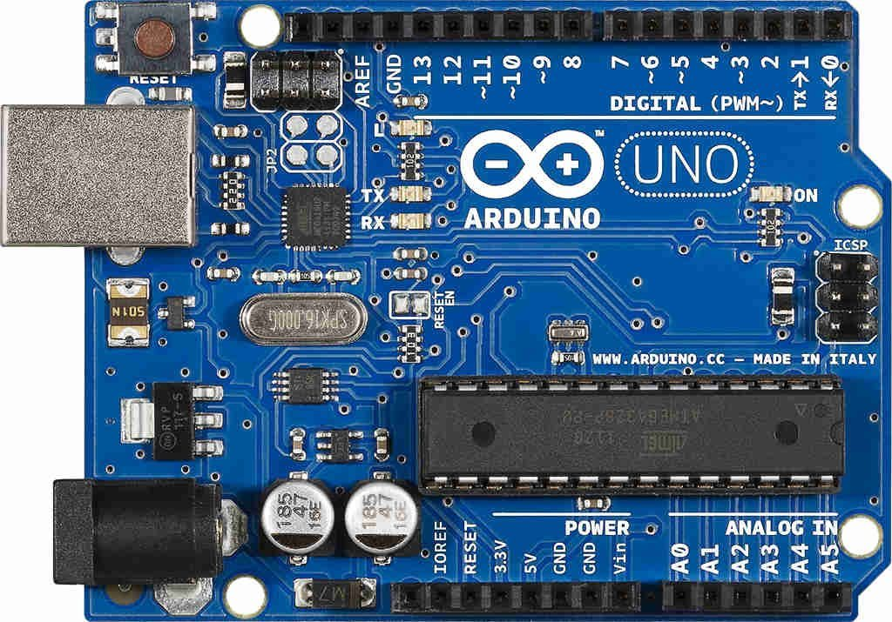|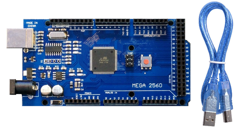|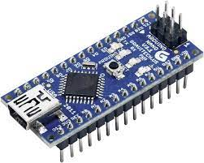|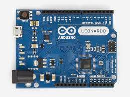|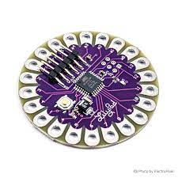|
|Arduino Uno|Arduino Mega|Arduino Nano|Arduino Leonardo|Arduino lilypad|

----

# Getting the Hardware 

- If you are in Nepal 
[https://himalayansolution.com/product/arduino-starter-kit-1](https://himalayansolution.com/product/arduino-starter-kit-1)
- Access to International Payment then 
[https://www.aliexpress.com/item/1005001653349193.html](https://www.aliexpress.com/item/1005001653349193.html)

### Stores in Nepal   
- Supreme Light Technology: [https://www.sltech.com.np/](https://www.sltech.com.np/)
- Himalayan Solution [https://himalayansolution.com/](https://himalayansolution.com/)

----
<style scoped>
h1 { font-size: 25px; }
ul {
font-size: 20px;
}
</style>
# Microcontroller and Microprocessor 

- Microcontroller is a chip that houses CPU, Memory(RAM ROM), I/O controllers all in a single package however Microprocessor however only has CPU 
- A computer basic operation is `input -> process -> output`
- Atmega328P has 32kb Of program Memory, 1kb of ROM and 2Kb of RAM

|Input|Process|Output|
|-----|-------|------|
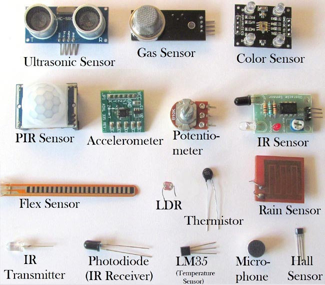|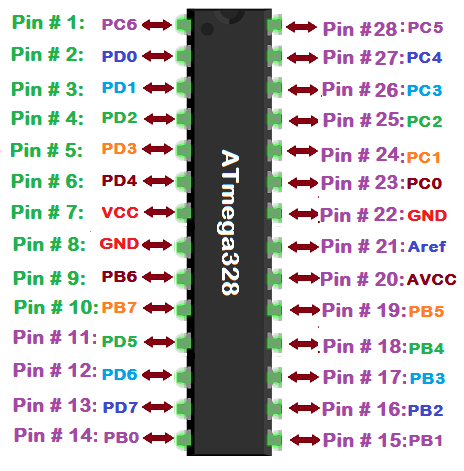|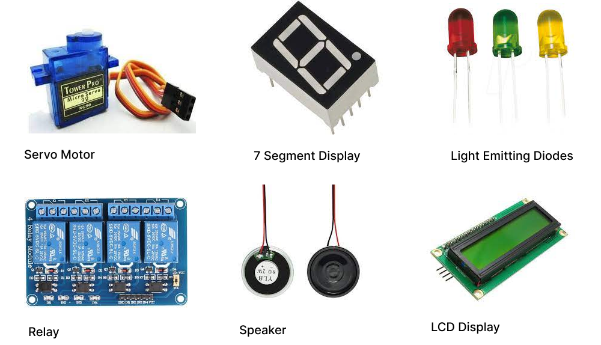|

----
# Arduino Board 

|Input|Output|
|-----|------|
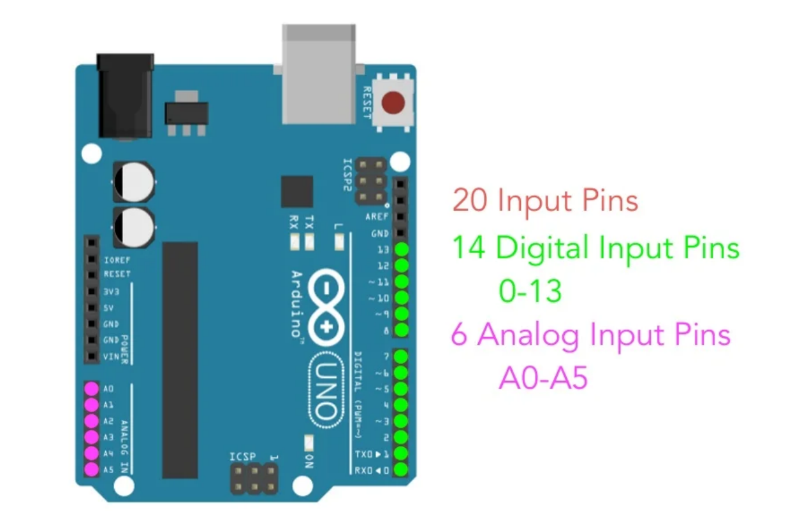|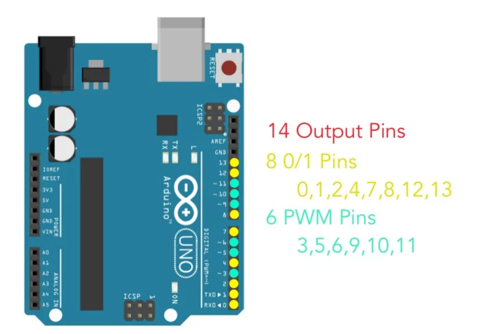|

----

<style scoped>
ul {
		font-size: 20px;
 }

 h2 { 
 	 	font-size: 20px;
 }
</style>

# Arduino Board Continued


## For Input
- Analog Pins : Used to read analog sensor data. i.e Potentiometer, Pressure Sensor, Accelerometer, LDR sensor
- Digital Pins : If sensor already has A/D converter or the output of the sensor is discrete then Digital pins are used. i.e Ultrasonic Sensor, Ball Switch Sensor. It can only detect OV or (3.3V/5V).


## For Output
- PWM Pins : Pulse Width Modulation can be thought as a square wave continiously being on and off, where on time is the pulse width and it defines duty cycle.
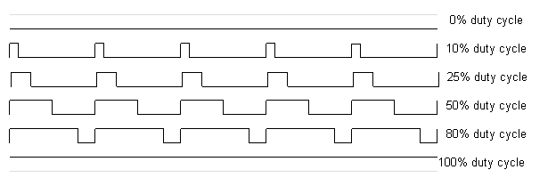
- Digital Pins: They either provide 0V as off or 5V as On. 


----
# Arduino Board continued

<style>
</style>
## Power Pins

|test|ok|
|----|----|
|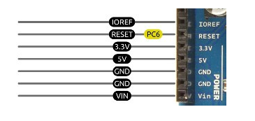|<div><ul><li>IOREF: Ioreference</li><li>RESET: Provide 5V to reset the board</li><li>3.3V: 3.3V output for sensors</li><li>5V: 5V output for sensors</li><li>GND: Ground Pin</li><li>VIN: Provide 5V to power the Arduino Uno Board </li></ul></div>|

----

# Installing Arduino IDE

- For Linux : [https://docs.arduino.cc/software/ide-v1/tutorials/Linux](https://docs.arduino.cc/software/ide-v1/tutorials/Linux)
- For Windows : [https://docs.arduino.cc/software/ide-v1/tutorials/Windows](https://docs.arduino.cc/software/ide-v1/tutorials/Windows)
- For Mac : [ https://www.arduino.cc/en/Guide/macOS ](https://www.arduino.cc/en/Guide/macOS)

----

# Overview of writing code on Arduino IDE 

- Write code in Arduino IDE
- Connect Arduino to PC using USB cable 
- Select the Port 
- Compile the Program
- click button on IDE to load the program 
- Done

----

# Write Some Code on Arduino IDE

### General Structure

```c
void setup() {
	// setup code that runs once
}

void loop() {
	// main code that runs repeatedly
}
```

----

# Example Code 

<style scoped>
a { 
	font-size: 20px;
}

</style>
Link to Simulator: https://wokwi.com/projects/338430633664578130

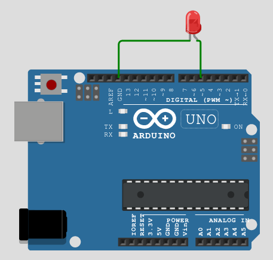

```c
void setup() {
  pinMode(5,OUTPUT); //set pin no 5 on OUTPUT mode
}

void loop() {
  digitalWrite(5, HIGH); // send 5V 
  delay(1000); // wait for 1 sec
  digitalWrite(5,LOW); // send 0 volts
  delay(1000); // wait for 1 sec
}

```

----


# Example Code B
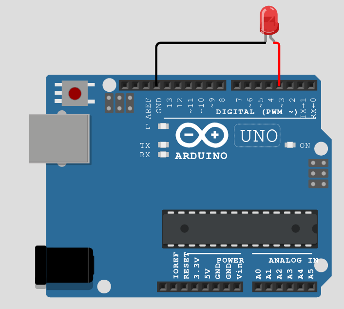
<style scoped>
a { 
	font-size: 20px;
}

</style>
Link to Simulator: https://wokwi.com/projects/338430886227739218 


```c
void setup() {
  pinMode(3, OUTPUT); // connected to PWM output
}

void loop() {
  analogWrite(3,255);  // to show how bright LED is at first
  delay(1000); // later fades away

  for(int i=0;i<255;i++){
    analogWrite(3,i); // analogWrite(pin, value) ; where value can range from 0 to 255.
    delay(100); // 0.1 sec delay
  }
}
```

-----

# Javascript and Arduino

- About Javascript here


