# Arduino And Javascript 
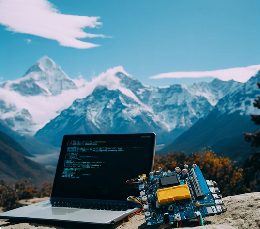
<a href="https://github.com/voidash">Click to ⭐ the Project</a>
<style scoped>
  button {
    font-size: 30px;
  }
  a {
    padding: 20px;
    border: 1px solid black;
    border-radius:25px;
    text-decoration: none;
    transition:background ease 0.1s;
  }
  a:hover {
    background: blue;
    color: white;
  }
</style>

-----

## WhoAmI


[voidash](github.com/voidash)
github.com/sudhansu

-----
 # Arduino 

- A company in Italy 
- Arduino is referred to physical programmable circuit board (microcontoller)
- ArduinoIDE 


----

# Agenda


----
# Without Arduino Ecosystem

- Tooling is hard as it requires special programming skills and deep knowledge on how chip works and how to communicate with it.
- How to do without Arduino IDE
		- Read the manual
		- While programming disable std features and define the target architecture or download one
		- or program in assembly and use assembler 
		- Then use serial interface such as RS-232 to flash the chip. 
----

# Why Arduino 

- Great for prototyping
- cross platform
- Has a very low power requirements
- Is open source with large community
- Doesn't require a degree worth of studying to program it.  
- Very Cheap

----

# What is possible with Arduino

- Insert Some projects here 

----

# Arduino Flavors 

||||||
|---|---|---|---|---|
|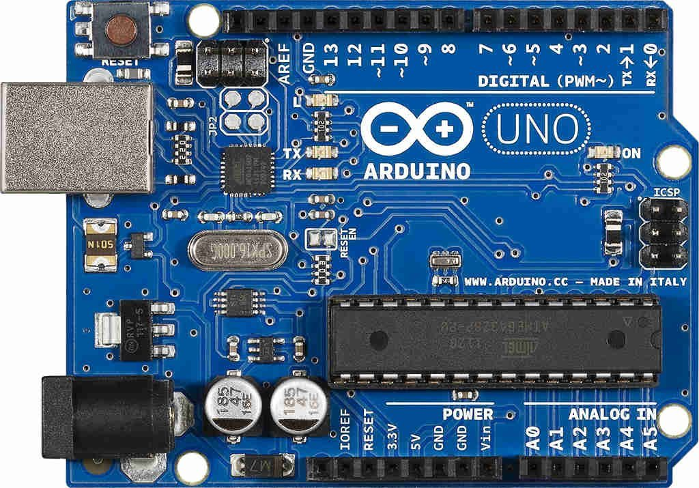|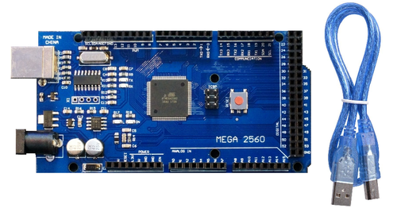|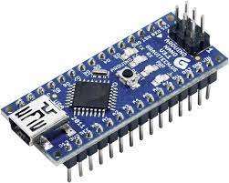|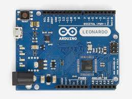|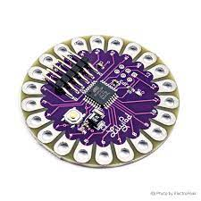|
|Arduino Uno|Arduino Mega|Arduino Nano|Arduino Leonardo|Arduino lilypad|

----

# Getting the Hardware 

- If you are in Nepal 
[https://himalayansolution.com/product/arduino-starter-kit-1](https://himalayansolution.com/product/arduino-starter-kit-1)
- Access to International Payment then 
[https://www.aliexpress.com/item/1005001653349193.html](https://www.aliexpress.com/item/1005001653349193.html)

### Stores in Nepal   
- Supreme Light Technology: [https://www.sltech.com.np/](https://www.sltech.com.np/)
- Himalayan Solution [https://himalayansolution.com/](https://himalayansolution.com/)

----
<style scoped>
h1 { font-size: 25px; }
ul {
font-size: 20px;
}
</style>
# Microcontroller and Microprocessor 

- Microcontroller is a chip that houses CPU, Memory(RAM ROM), I/O controllers all in a single package however Microprocessor however only has CPU 
- A computer basic operation is `input -> process -> output`
- Atmega328P has 32kb Of program Memory, 1kb of ROM and 2Kb of RAM

|Input|Process|Output|
|-----|-------|------|
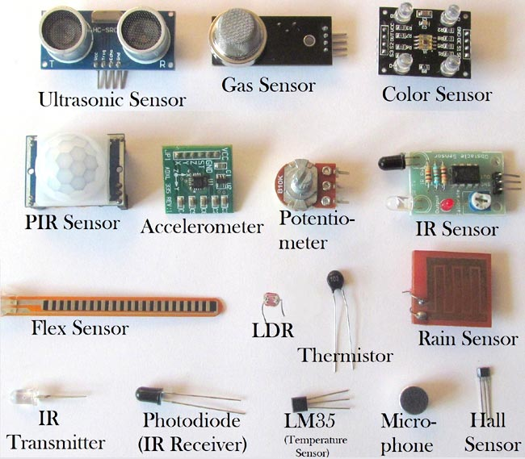|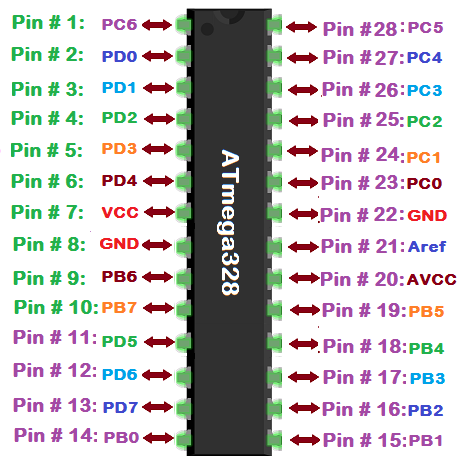|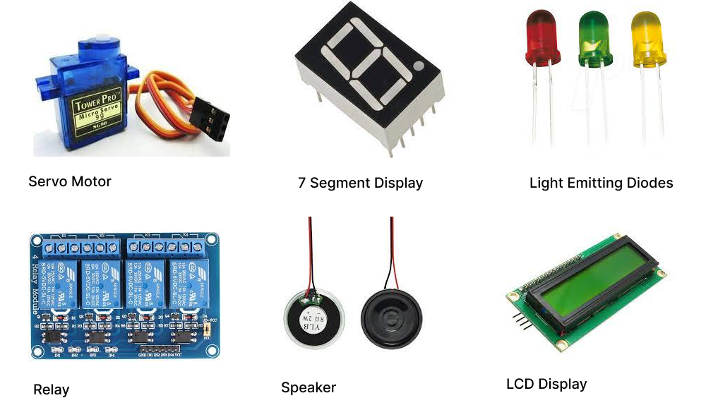|

----
# Arduino Board 

|Input|Output|
|-----|------|
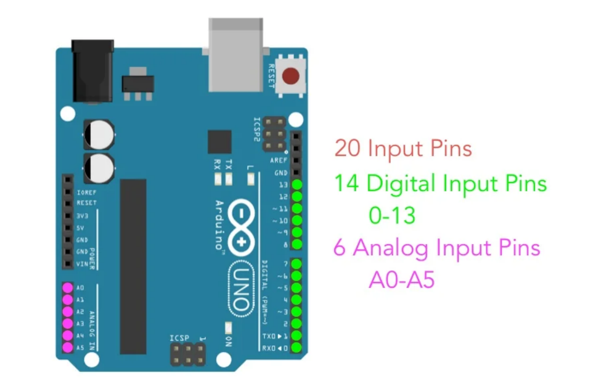|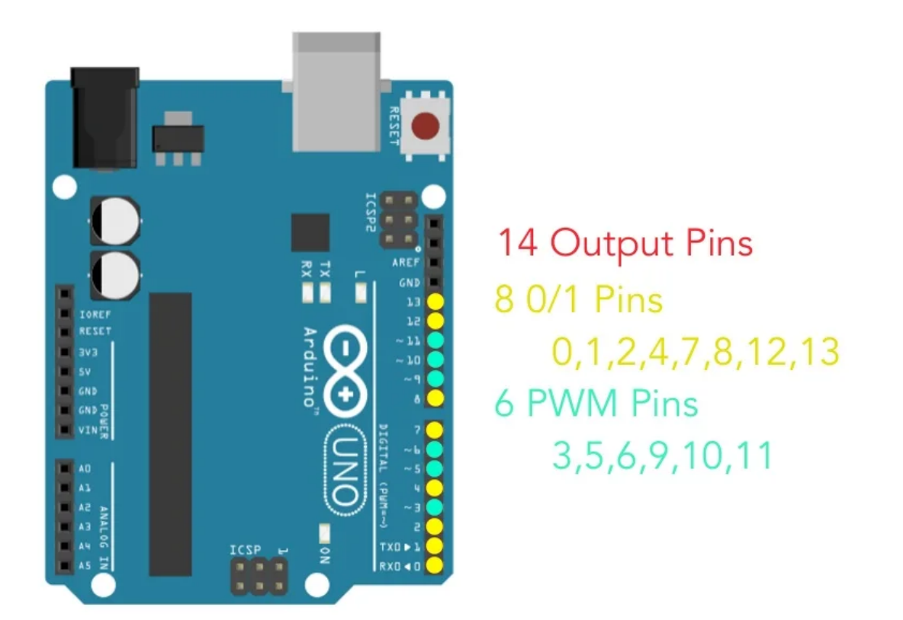|

----

<style scoped>
ul {
		font-size: 20px;
 }

 h2 { 
 	 	font-size: 20px;
 }
</style>

# Arduino Board Continued


## For Input
- Analog Pins : Used to read analog sensor data. i.e Potentiometer, Pressure Sensor, Accelerometer, LDR sensor
- Digital Pins : If sensor already has A/D converter or the output of the sensor is discrete then Digital pins are used. i.e Ultrasonic Sensor, Ball Switch Sensor. It can only detect OV or (3.3V/5V).


## For Output
- PWM Pins : Pulse Width Modulation can be thought as a square wave continiously being on and off, where on time is the pulse width and it defines duty cycle.
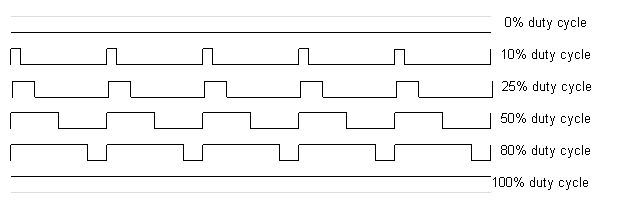
- Digital Pins: They either provide 0V as off or 5V as On. 


----
# Arduino Board continued

<style>
</style>
## Power Pins

|test|ok|
|----|----|
|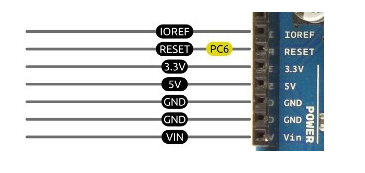|<div><ul><li>IOREF: Ioreference</li><li>RESET: Provide 5V to reset the board</li><li>3.3V: 3.3V output for sensors</li><li>5V: 5V output for sensors</li><li>GND: Ground Pin</li><li>VIN: Provide 5V to power the Arduino Uno Board </li></ul></div>|

----

# Basics of Electronics


* Ohm's law $V = IR$

| | |
|--------------- | --------------- |
| 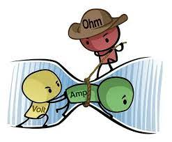 | 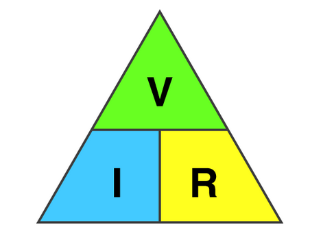|

* Voltage : Electric Pressure
* Current : Flow of electrons
* Resistance : Measure of opposition of current flow 

----

# Resistor
<center>
  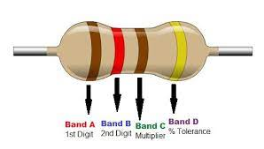
</center>

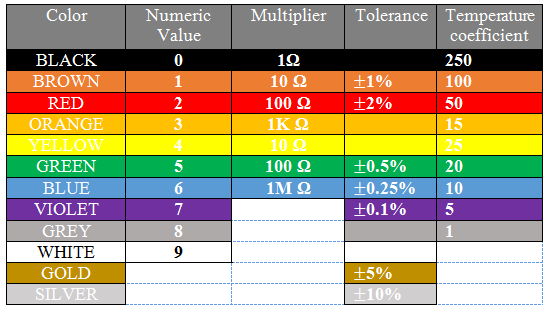

----

# Exercise 
|||
|-------------- | -------------- 
|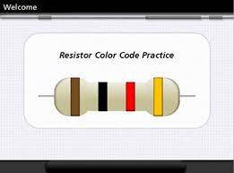|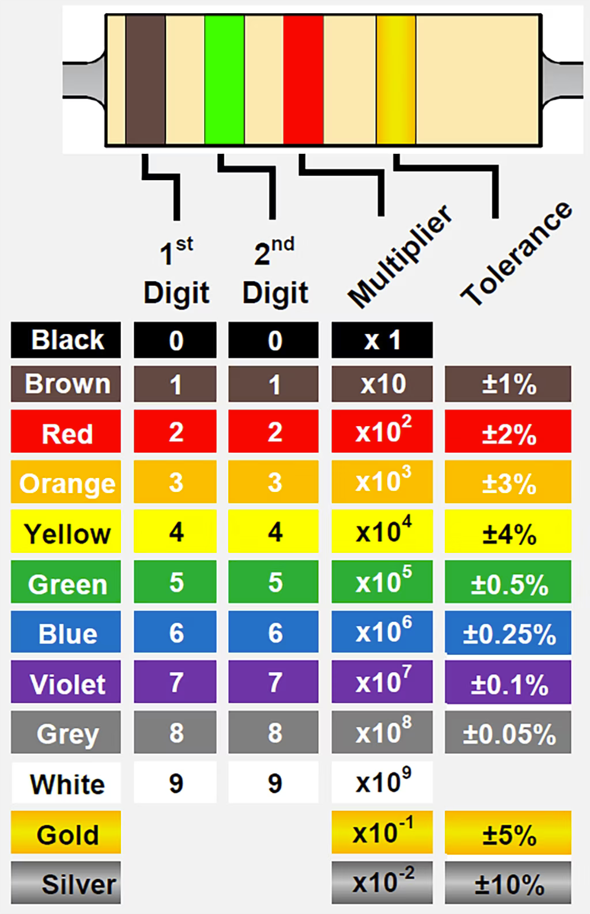 |

----

# Breadboard

- For Electronics Prototyping

| Outside   | Inside    |
|--------------- | --------------- |
| 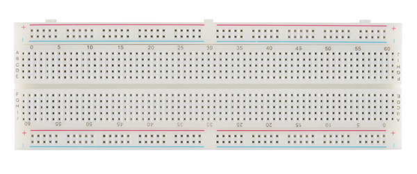 | 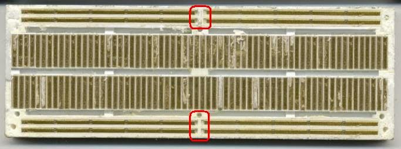|

----

# Breadboard Continued

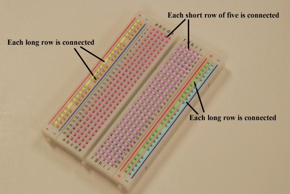

----

# Breadboard Continued

| Column1   | Column2    |
|--------------- | --------------- |
| 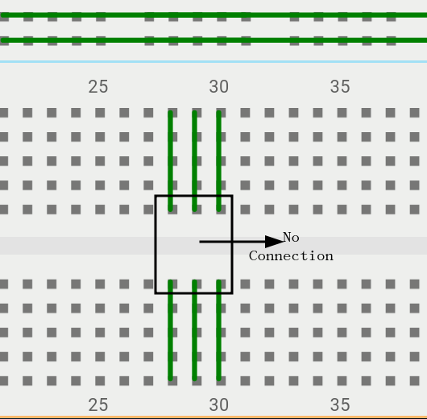| 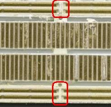|


----

# LED (Light Emitting Diode)

https://www.toppr.com/bytes/principles-of-led/

* Active Semiconductor Device

| Column1  | Column2   | Column3   |
|-------------- | -------------- | -------------- |
| 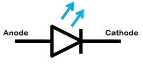 |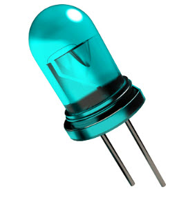| 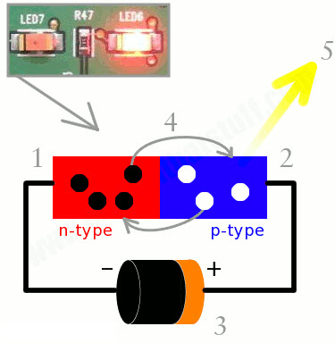 |

----

# LED

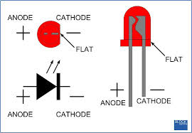

----

# Series and Parallel Resistance
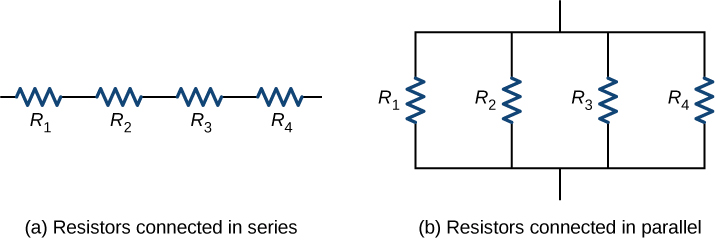

- Series Resistance $R_{eq} = R1 + R2 + R3 + R4$

- Parallel Resistance $\frac{1}{R_{eq}} = \frac{1}{R1}+ \frac{1}{R2}+ \frac{1}{R3}+ \frac{1}{R4}$

----

# Lets Build A Circuit

#### Series Resistance

https://wokwi.com/projects/376191541801099265

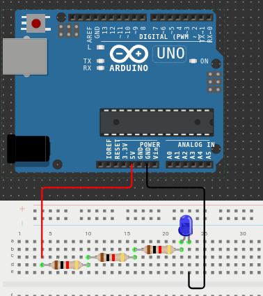 

* Was there decrement in LED Glow?

----

## Breadboard Path 

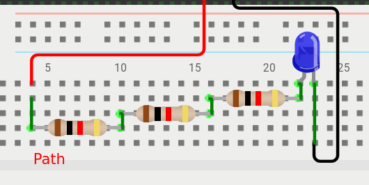 

----

## Common Mistakes

| | | |
|-------------- | -------------- | -------------- |
|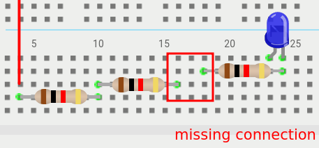| 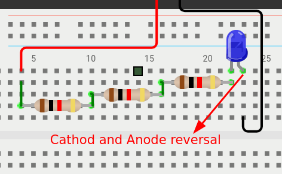|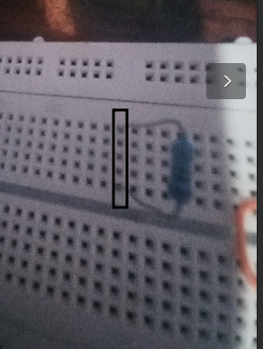      |


----


# Lets Build A Circuit

#### Parallel Resitance 

https://wokwi.com/projects/376191892088461313

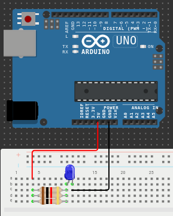

* Was there increment in LED Glow?

----

# Potentiometer : Variabe Resitor

* $R = \rho\frac{L}{A}$


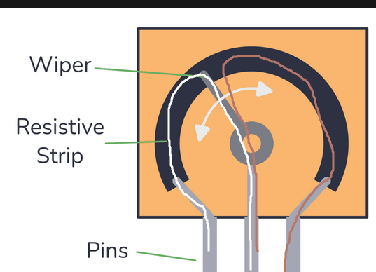

----

# Build a circuit 

* Potentiometer
https://wokwi.com/projects/376209822976702465

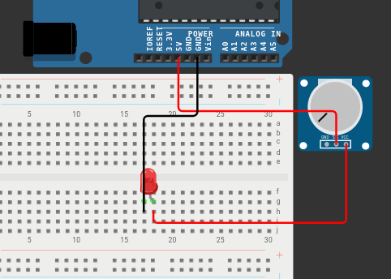


----

## Potentiometer Video


<video controls="controls" width="600" src="./assets/pot.mp4">
  Your browser doesn't support video tag
</video>


----


# Installing Arduino IDE

- For Linux : [https://docs.arduino.cc/software/ide-v1/tutorials/Linux](https://docs.arduino.cc/software/ide-v1/tutorials/Linux)
- For Windows : [https://docs.arduino.cc/software/ide-v1/tutorials/Windows](https://docs.arduino.cc/software/ide-v1/tutorials/Windows)
- For Mac : [ https://www.arduino.cc/en/Guide/macOS ](https://www.arduino.cc/en/Guide/macOS)

----

# Overview of writing code on Arduino IDE 

- Write code in Arduino IDE
- Connect Arduino to PC using USB cable 
- Select the Port 
- Compile the Program
- click button on IDE to load the program 
- Done

----

# Write Some Code on Arduino IDE

### General Structure

```c
void setup() {
	// setup code that runs once
}

void loop() {
	// main code that runs repeatedly
}
```

----

# Example Code 

<style scoped>
a { 
	font-size: 20px;
}

</style>
Link to Simulator: https://wokwi.com/projects/338430633664578130

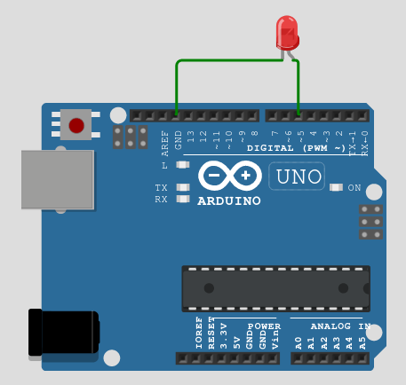

```c
void setup() {
  pinMode(5,OUTPUT); //set pin no 5 on OUTPUT mode
}

void loop() {
  digitalWrite(5, HIGH); // send 5V 
  delay(1000); // wait for 1 sec
  digitalWrite(5,LOW); // send 0 volts
  delay(1000); // wait for 1 sec
}

```

----


# Example Code B
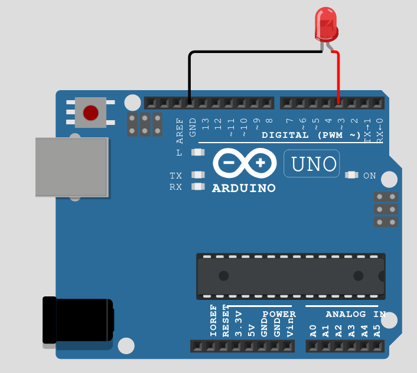
<style scoped>
a { 
	font-size: 20px;
}

</style>
Link to Simulator: https://wokwi.com/projects/338430886227739218 


```c
void setup() {
  pinMode(3, OUTPUT); // connected to PWM output
}

void loop() {
  analogWrite(3,255);  // to show how bright LED is at first
  delay(1000); // later fades away

  for(int i=0;i<255;i++){
    analogWrite(3,i); // analogWrite(pin, value) ; where value can range from 0 to 255.
    delay(100); // 0.1 sec delay
  }
}
```

-----

# Firmata 

- Protocol for communicating with microcontrollers from software on a computer.
- All you need is to implement the protocol then any microcontroller can be supported.

### To Upload Firmata

- connect the arduino to pc using USB cable
- open the arduino ide, select file>examples>firmata>StandardFirmata
- select port
- click upload


-----

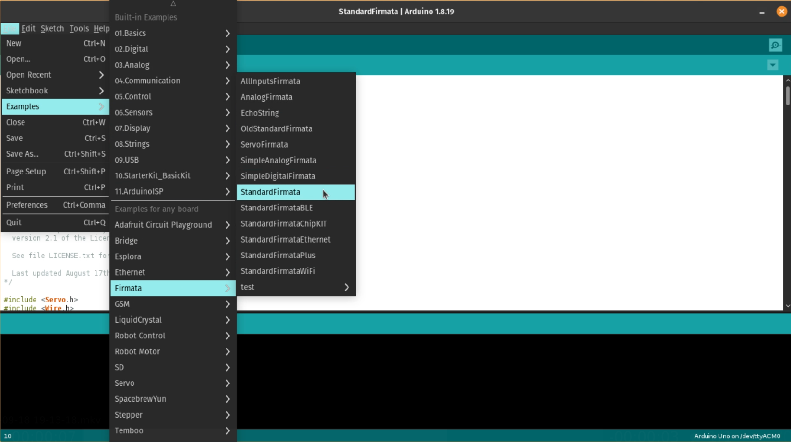

-----

# Firmata 

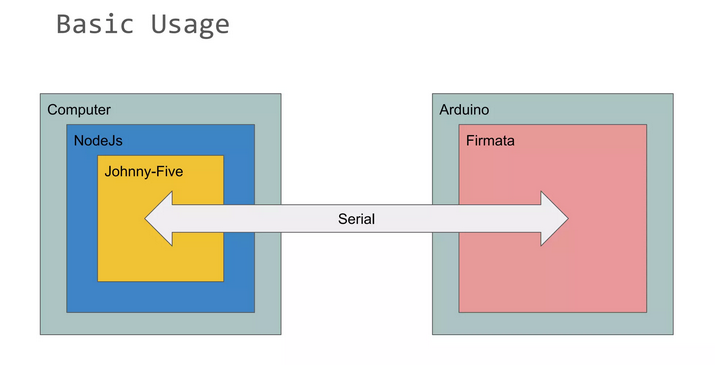

-----

# Led Blink 
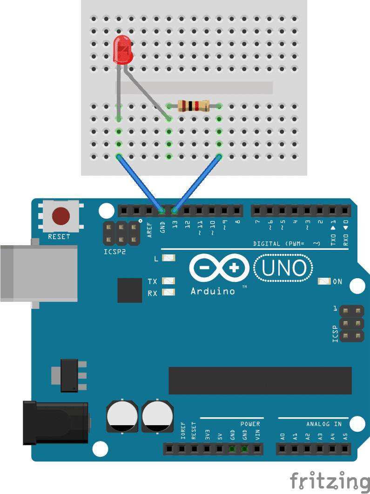

```
  var five = require("johnny-five");
  var board = new five.Board();

  board.on("ready", function() {
      var led = new five.Led(13);
      led.blink(500);
  });
```

-----

# PushButton

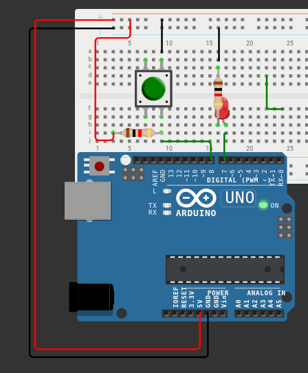
 ```
var five = require("johnny-five");
var board = new five.Board();

board.on("ready", function() {
    const led = new five.Led(7);
    const pushButton = new five.Button(
        {
            pin: 8,
            isPullup : true
        }
    );
    pushButton.on('down', () => {

        if (!led.isOn) {led.on();} else {led.off()}
    });

});
 ```                                                    
----

# Analog Sensors

----


# Analog Vs Digital

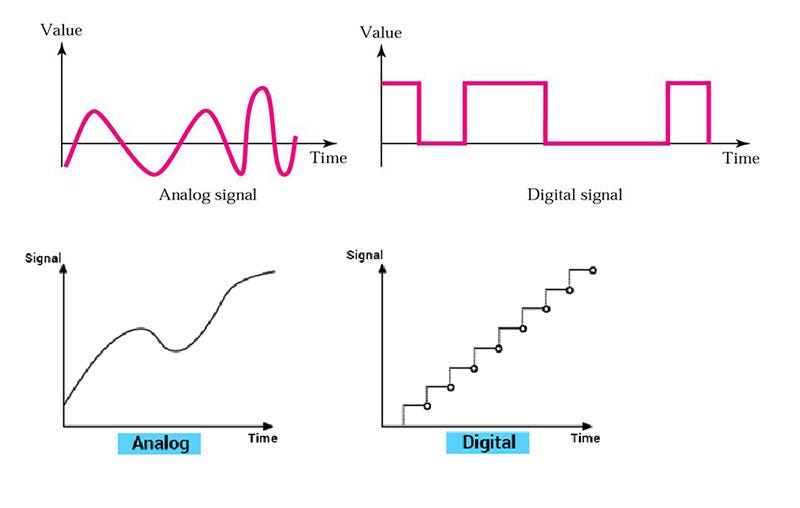

----
# Analog Vs Digital

| Aspect                  | Analog                                      | Digital                                  |
|-------------------------|---------------------------------------------|------------------------------------------|
| Data Representation     | Continuous waveform                         | Discrete binary values (0s and 1s)       |
| Accuracy                | High accuracy and precision                | Excellent accuracy within bit resolution |
| Noise Resistance        | Susceptible to noise and interference      | More robust against noise                |
| Signal Processing       | Suitable for amplification, filtering, etc. | Versatile for complex algorithms        |
| Cost and Complexity     | Often simpler and potentially cheaper     | Can be more complex and costly          |

<style scoped>
  * {
    font-size: 25px;
  }
</style>

----

# LDR (Light Dependent Resistor)

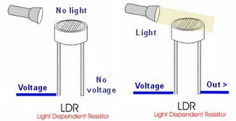

----

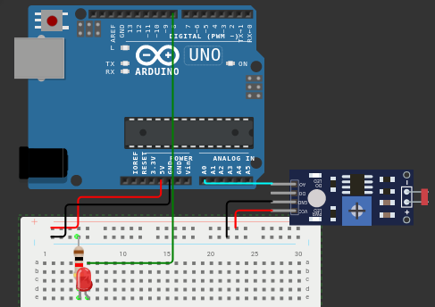
https://johnny-five.io/api/sensor/
```
var five = require("johnny-five");

board = new five.Board();

board.on("ready", function() {

    let photoresistor = new five.Sensor({
        pin: "A0",
        freq: 500
    });

    let led = new five.Led(8);

    // board.repl.inject({
    //     pot: photoresistor
    // });

    photoresistor.on("data", function() {
        console.log(this.value);
        if (this.value >= 1000) {
            led.on();
        }else {
            led.off();
        }
    });
});
```
----

##  Equivalent C code

https://wokwi.com/projects/376361780745305089

```
#define LDR A0
#define LED 8

void setup() {
pinMode(8, OUTPUT);
pinMode(A0, INPUT); 

}

void loop() {
  if (analogRead(A0) >= 1000) {
    digitalWrite(LED, HIGH);
  }else {
    digitalWrite(LED, LOW);
  }
}

```
----
# Servo Control

----

# Motors
 Motor Type | Description | Image |
|------------|-------------|-------|
| Stepper    | Converts electrical pulses into precise mechanical steps. Used in 3D printers and CNC machines. |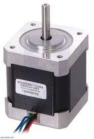 |
| Servo      | Provides accurate angular control, common in robotics. | 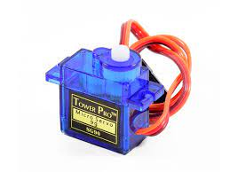|
| DC         | Operates on direct current, simple, and used in various applications. | 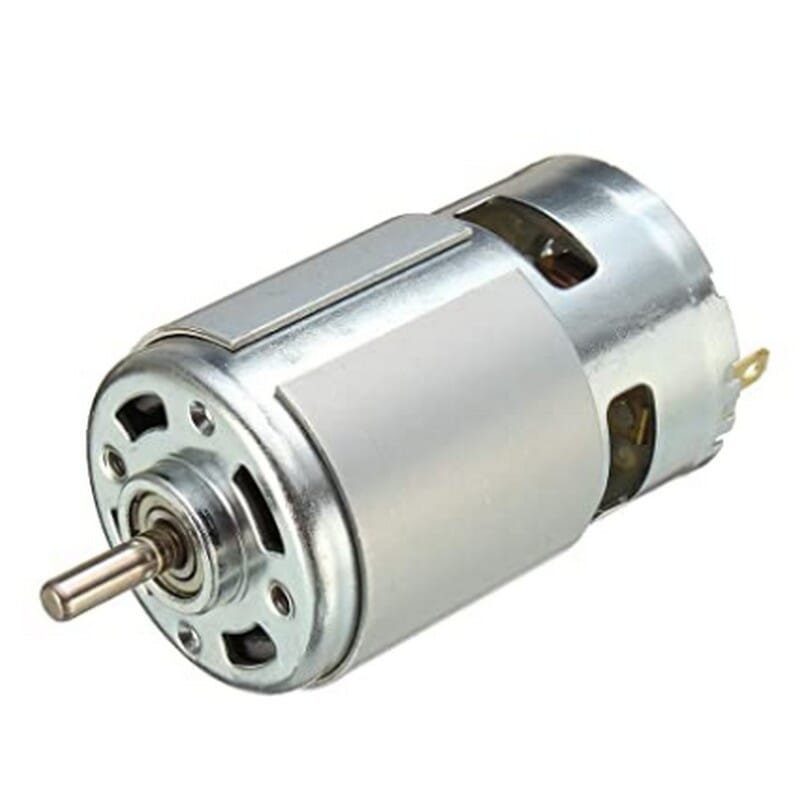|

<style scoped>
  * {
    font-size: 20px;
  }
  img {
    width:130px;
  }
  </style>
----

# Servo Motor
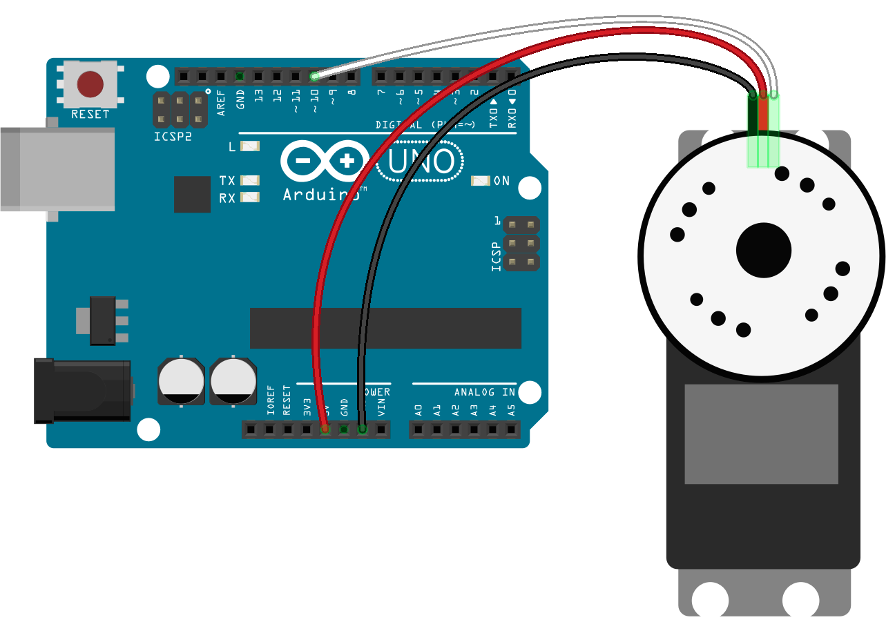
```
const five = require("johnny-five");
const board = new five.Board();

board.on("ready", () => {
    const servo = new five.Servo(10);

    board.repl.inject({
        servo
      });
    servo.sweep();
})

```

----

# Build a project 

## LED Binary Counter

----

# Circuit

https://wokwi.com/projects/376380254565660673

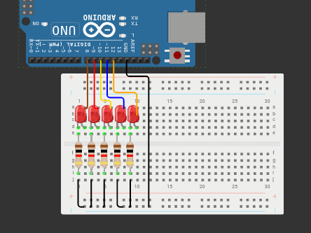

----

```
const five = require("johnny-five");
const board = new five.Board();


board.on("ready", () => {
    let leds = [8,9,10,11,12].map((pinNo) => {
       return new five.Led(pinNo);
    });

    for (let i = 0 ; i <= 31; i++) {
        setTimeout(() => {ledState(i.toString(2).padStart(5,'0') ,leds)},i * 1000);
    }


}) ;

function ledState(ledString,leds) {
    Array.from("00000").map((val,index) => setLedState(leds[index], parseInt(val)));
    Array.from(ledString).map((val,index) => setLedState(leds[index], parseInt(val)));
}

function setLedState(led, state) {
    state == 1 ? led.on() : led.off();
}
```
----

 # Thankyou

----