# Line Following Robot 

<a href="https://github.com/voidash">Voidash</a>
<style scoped>
  button {
    font-size: 30px;
  }
  a {
    padding: 20px;
    border: 1px solid black;
    border-radius:25px;
    text-decoration: none;
    transition:background ease 0.1s;
  }
  a:hover {
    background: blue;
    color: white;
  }
</style>

-----

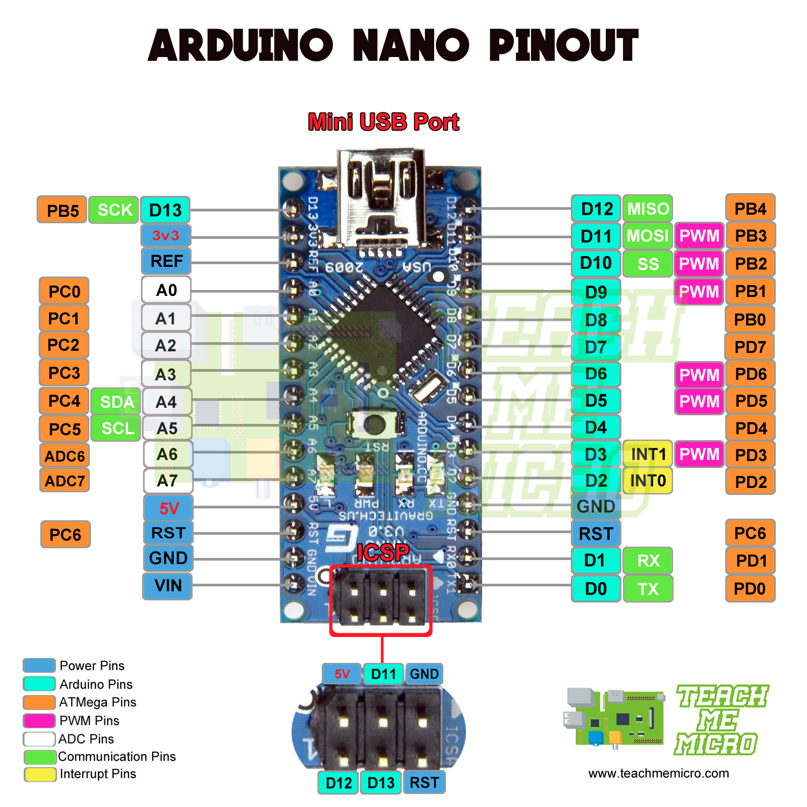

-----
# PWM (Pulse width modulation)

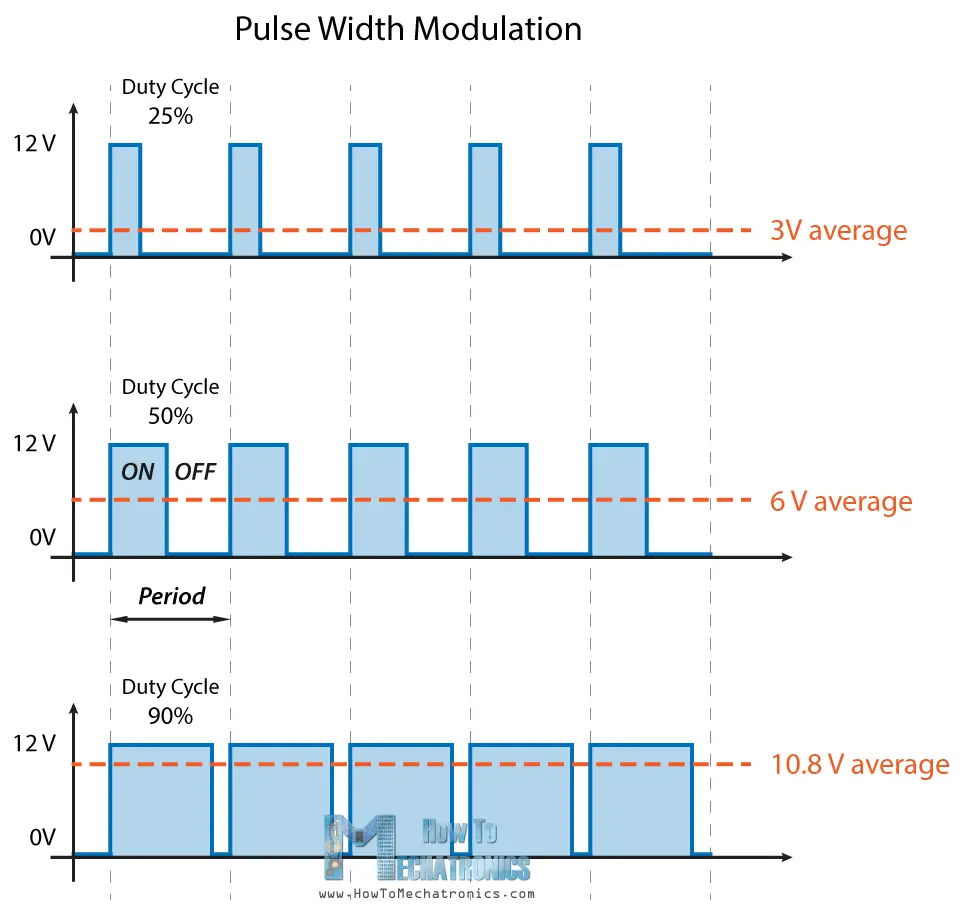

-----

 # Basics of IR Sensor 

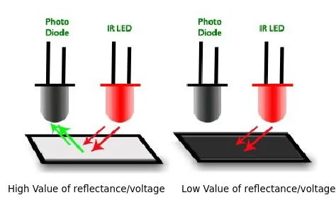

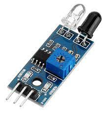

----
```

int lm = 5;
int l1 = 18;
int c = 19;
int r1 = 22;
int rm = 21;

int irPins[] = {lm,l1,c,r1,rm};

int pinRead[] = {0,0,0,0,0};
void setup() {

  pinMode(lm, INPUT);
  pinMode(l1, INPUT);
  pinMode(c, INPUT);
  pinMode(r1, INPUT);
  pinMode(rm, INPUT);

  // for debugging.  The output will appear on the serial monitor
  // To open the serial monitor, click the magnafing glass icon in the upper right corner
  Serial.begin(115200);      
  
}

void loop() {

  for(int i = 0 ;i < 5; i++){
    pinRead[i] = digitalRead(irPins[i]);
  }
  for(int i = 0 ;i < 5; i++){
    Serial.print(pinRead[i]);
  }
  Serial.println();
  delay(300);

}
```
----

# H Bridge 

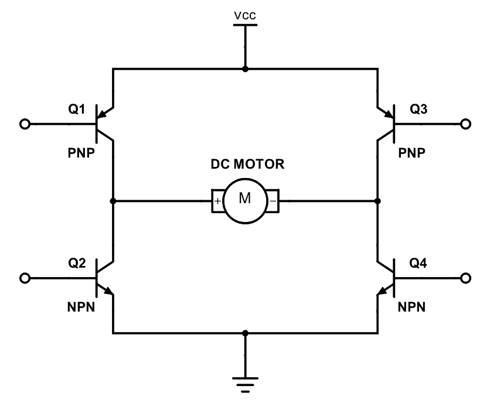

- controls the direction of rotation of DC motor, clockwise or anticlockwise
- if Q1 and Q4 are turned on then the motor moves clockwise
- if Q2 and Q3 are turned on then the motor moves anticlockwise


----

# Motor Control
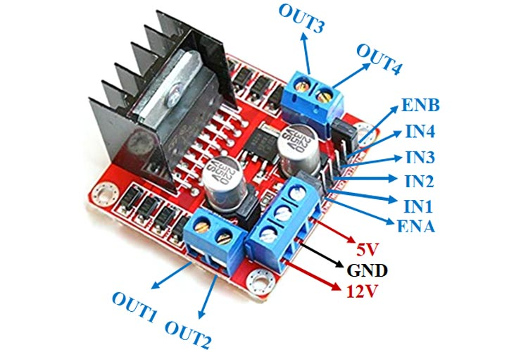

| Pin Name | Description |
|----------|-------------|
| IN1 & IN2 | Motor A input pins. Used to control the spinning direction of Motor A |
| IN3 & IN4 | Motor B input pins. Used to control the spinning direction of Motor B |
| ENA      | Enables PWM signal for Motor A |
| ENB      | Enables PWM signal for Motor B |
| OUT1 & OUT2 | Output pins of Motor A |
| OUT3 & OUT4 | Output pins of Motor B |
| 12V      | 12V input from DC power Source |
| 5V       | Supplies power for the switching logic circuitry inside L298N IC |
| GND      | Ground pin |


<style scoped>
  table {
    font-size: 20px;
  }
</style>

----
# Motor test

```
int right_forward = 26;
int right_reverse = 27;
int left_forward = 33;
int left_reverse = 25;
int delay_time_on = 2000; // how long should each wheel turn?
int delay_time_off = 2000; // delay between tests

void setup() {
  // Turn these pins on for PWM OUTPUT
  pinMode(right_forward, OUTPUT);
  pinMode(right_reverse, OUTPUT); 
  pinMode(left_forward, OUTPUT); 
  pinMode(left_reverse, OUTPUT);
  // turn all the motors off
  digitalWrite(right_forward, LOW);
  digitalWrite(right_reverse, LOW);
  digitalWrite(left_forward, LOW);
  digitalWrite(left_reverse, LOW);
  // for debugging.  The output will appear on the serial monitor
  // To open the serial monitor, click the magnafing glass icon in the upper right corner
  Serial.begin(115200);      
}

void loop() {
  Serial.println("Right Forward Test");
  digitalWrite(right_forward, HIGH);
  delay(delay_time_on);
  digitalWrite(right_forward, LOW);
  delay(delay_time_off);

  Serial.println("Right reverse test");
  digitalWrite(right_reverse, HIGH);
  delay(delay_time_on);
  digitalWrite(right_reverse, LOW);
  delay(delay_time_off);

  Serial.println("Left Forward Test");
  digitalWrite(left_forward, HIGH);
  delay(delay_time_on);
  digitalWrite(left_forward, LOW);
  delay(delay_time_off);

  Serial.println("Left Reverse Test");
  digitalWrite(left_reverse, HIGH);
  delay(delay_time_on);
  digitalWrite(left_reverse, LOW);
  delay(delay_time_off);
}
```


----

# Feedback control

- we have 5 IR Sensors 
  - Active means the IR is being reflected (happens with White)
  - lets encode each IR sensor as 0 or 1
    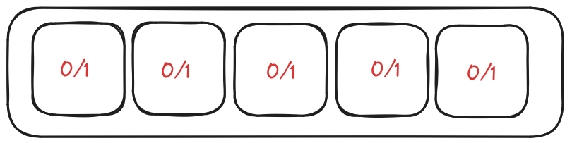


---

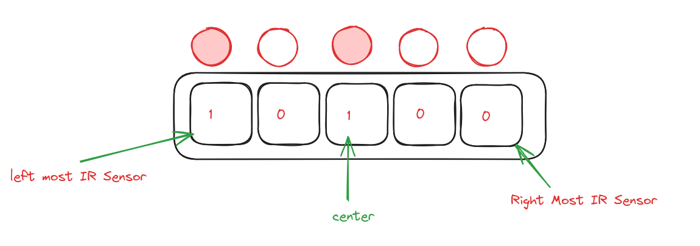

---

```
int lm = 5;
int l1 = 18;
int c = 19;
int r1 = 22;
int rm = 21;

int irPins[] = {lm,l1,c,r1,rm};

int pinRead[] = {0,0,0,0,0};

```
---

# Defining Penalty System and Error Value

- First, when should we stop?
  - when everything is white `11111` (reflected)
  - when everything is black `00000` ? 
  - there are definitely edge cases, which we will talk about
- when should we move forward, left , Right? 
  - Lets design a penalty system based on Error

---

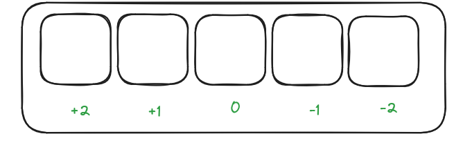 

<hr/>

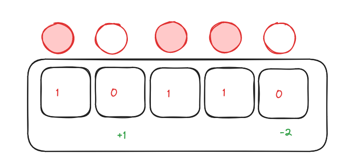
$error = -2 + 1 = -1$

---

# $Penalty$

- if error is postive $error > 0$ then it means right wheel should move

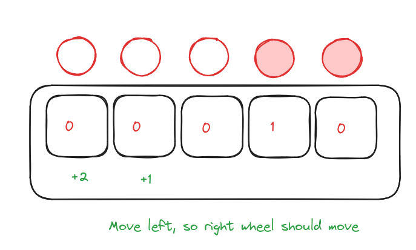


---

# $Penalty$

- if error is negative $error < 0$ then it means left wheel should move, so the car moves right

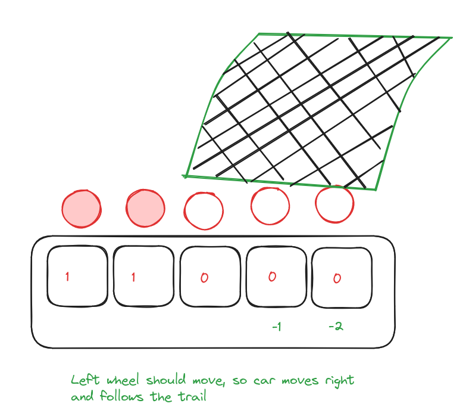

---
# $Penalty$

  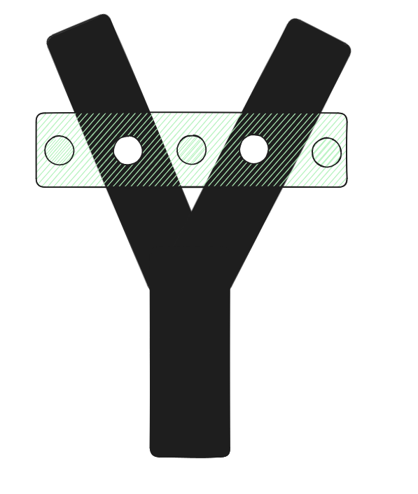
- If Error is equal to zero 
  - if sum of IR Sensor error values is equal to zero then you can either stop or choose left or right

---

# $Penalty$

- If error is equal to zero, and other IR on Left and Right was not triggered then move forward

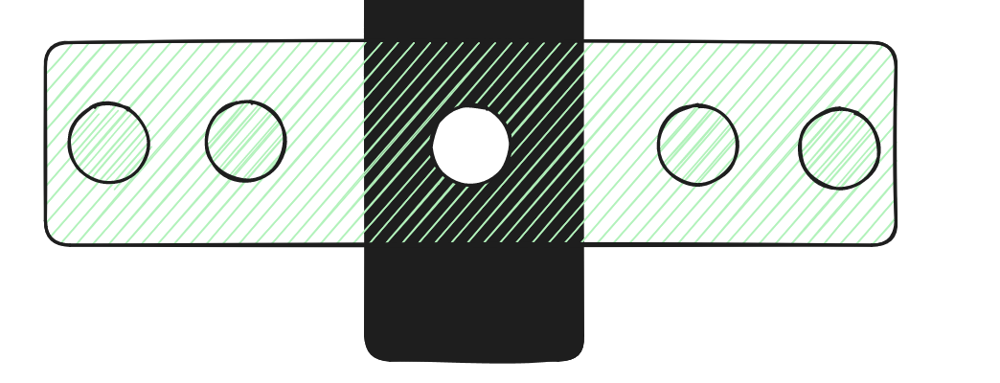

---

# Final code

```
int right_forward = 26;
int right_reverse = 27;
int left_forward = 33;
int left_reverse = 25;
int delay_time_on = 50; // how long should each wheel turn?
int delay_time_off = 50; 


int lm = 5;
int l1 = 18;
int c = 19;
int r1 = 22;
int rm = 21;

int irPins[] = {lm,l1,c,r1,rm};

int pinRead[] = {0,0,0,0,0};
void setup() {
  pinMode(right_forward, OUTPUT);
  pinMode(right_reverse, OUTPUT); 
  pinMode(left_forward, OUTPUT); 
  pinMode(left_reverse, OUTPUT);
  // turn all the motors off
  digitalWrite(right_forward, LOW);
  digitalWrite(right_reverse, LOW);
  digitalWrite(left_forward, LOW);
  digitalWrite(left_reverse, LOW);

  pinMode(lm, INPUT);
  pinMode(l1, INPUT);
  pinMode(c, INPUT);
  pinMode(r1, INPUT);
  pinMode(rm, INPUT);

  // for debugging.  The output will appear on the serial monitor
  // To open the serial monitor, click the magnafing glass icon in the upper right corner
  Serial.begin(115200);      
  
}

void loop() {

  for(int i = 0 ;i < 5; i++){
    pinRead[i] = digitalRead(irPins[i]);
  }
  for(int i = 0 ;i < 5; i++){
    Serial.print(pinRead[i]);
  }
  Serial.println("");

 // our error will be zero if the center IR is inactive

 // lets design a penalty based system where 
 // if positive right wheel will move
 // if negative left wheel will move

 int error = 0;
 
// lm
bool moveFlag = false; 
if (pinRead[0] == 0 ) { error += 2; moveFlag = true;}
if (pinRead[1] == 0 ) {error += 1; moveFlag = true;}
if (pinRead[3] == 0 ) {error -= 1; moveFlag = true;}
if (pinRead[4] == 0 ) {error -= 2; moveFlag = true;}


if(error > 0 ) {
  Serial.println("right wheel moves");
  rightWheelMoves();
}else if(error < 0) {
  Serial.println("left wheel moves");
  leftWheelMoves();
} else if(error == 0) {
   if (moveFlag == false && pinRead[2] == 0) {
    Serial.println("move forward");
    moveForward();
   }else{
      if (moveFlag) {
          if (pinRead[0] == 0 && pinRead[1] == 0 && pinRead[2] == 0 && pinRead[3] == 0 && pinRead[4] == 0) {
            Serial.println("stop");
            Stop();
          }
          else {
             Serial.println("move forward");
             moveForward();
          }
   
     }else {
      Serial.println("stop");
      Stop();
     }
   }
   
  
  
   
}
delay(50);
}

void leftWheelMoves() {
  
  digitalWrite(left_forward, HIGH);
  delay(delay_time_on);
  digitalWrite(left_forward, LOW);
  delay(delay_time_off);
}

void rightWheelMoves() {

  digitalWrite(right_forward, HIGH);
  delay(delay_time_on);
  digitalWrite(right_forward, LOW);
  delay(delay_time_off);
}

void moveForward() {
  
  digitalWrite(left_forward, HIGH);
  digitalWrite(right_forward, HIGH);
  delay(delay_time_on);
  digitalWrite(left_forward, LOW);
  digitalWrite(right_forward, LOW);
  delay(delay_time_off);
}

void Stop() {
  digitalWrite(right_forward, LOW);
  digitalWrite(right_reverse, LOW);
  digitalWrite(left_forward, LOW);
  digitalWrite(left_reverse, LOW);
}


```

----
# What is PID 

- most common form of feedback control 
- there are PI control, PD control, etc too

```
PID controllers use 3 basic behaviour types of modes:

P — proportional

I — integral

D — derivative.
```

----

- 


----


 # Thankyou

----