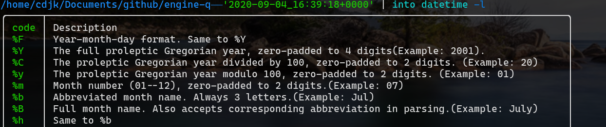

# Contribution to Open Source Projects


Ashish Thapa

github.com/voidash
ashish.thapa477@gmail.com

------


# Why Discuss Open Source?

- Most of the tools on Programmers belt are Open source.  
- Open source motto  **Innovation through collaboration**.  
- Open source software are free and permissive.
	- depends on license though

------

<style scoped>
	* {
			font-size:24px;
	 }
</style>

# Open Source for Learners/Progammers

- A large community maintaining a project means
	- Follows some Rule or guidelines
	- Codebase will have newer features 
	- Good documentation 
	- Toolchain usage 

- Learning opportunity 
	- can learn language new features
	- How everything is coupled together by understanding the toolchain. 
	- Process involved in writing a good code 
		- testing, documenting etc  
			- understading of design patterns
  - increases code comprehension skills 

-------

# How to find open source projects to contribute to

## Hactoberfest

- Digital Ocean initiative to cultivate open source collaboration.
- usually the projects who participated in this event or is about to particiapte has hacktober flair  
- Search for `hactoberfest [language of your choice]` on github  and on issues tab look for `good first issue` tags
.

----

[https://hacktoberfest.digitalocean.com/resources/beginners](https://hacktoberfest.digitalocean.com/resources/beginners)

<iframe
  src="https://hacktoberfest.digitalocean.com/resources/beginners"
  width="100%"
  height="700px"
  title="My file"
></iframe>


-------

# Exploring tools with `awesome lists`

- google `awesome [tool here]` i.e : `awesome cpp`, `awesome rust` available even for libraries `awesome react` etc
- pick a project then head to its issues tab and look for `good first issues` 


-------

[fffaraz.github.io/awesome-cpp/](fffaraz.github.io/awesome-cpp/)
<iframe
  src="https://github.com/fffaraz/awesome-cpp"
  width="100%"
  height="700px"
  title="My file"
></iframe>


------
# Projects from `good first issues` 

[https://goodfirstissue.dev/](https://goodfirstissue.dev/) allows you to pick a language and also lists all the issues with tag `good first issues`


-------


[https://goodfirstissue.dev/](https://goodfirstissue.dev/)

<iframe
  src="https://goodfirstissue.dev/"
  width="100%"
  height="700px"
  title="My file"
></iframe>

--------


### Before starting Contribution


|||
|--|--|
|Check its license. To understand restrictions and  permissions you can use [https://choosealicense.com/](https://choosealicense.com/)||
|Look into contributing Guidelines. Usually with name `CONTRIBUTING.md`. Usually contains how to setup project, how to make commit messages , contains link to their forum or discord community, and may contain contribution docs| |

-------

### Exploration Phase 


 If project has provided docs then look into it. 
		
|||
|--|--|
|By using referred way of compiling, compile the project, make some small changes. Overall use the application, library or Framework | |
| Ask questions on  community about the project. ||

-------

# Programming Phase


<style scoped>
	* {
			font-size:24px;
	 }
</style>
- You must have some vague idea about how the toolchain works 

- Good Code editor makes all the difference.
    - generally to find the hints dropped on forums, chat or help section you need to search through whole project
    - you might looking for specific implementation

- Vscode and Vim advice.
  - install the extension for the language you are working on.
  - learn to use debugger, setting breakpoints, jumping in , jumping out etc. 
- Search for `word` or `pattern` in whole project files and directory with `Ctrl+Shift+f`. Or just click on search icon on Activity Bar(one on left most side). `install RipGrep and fzf plugin for vim`
- `ctrl + click` on any signature such as function call, class call will show the implementation. ` gd on normal mode if you have coc-vim installed`


-------

# Contribution phase

- Fork the project before starting to make changes.
- Once you make necessary changes. before commiting, check on contributing guidelines if there is a specific format for commit message being used. 
- General commit message look like

```
Description of what you did. (#issue_number)
example:
ask to generate `config.nu` if it doesn't exist (#869)`
```
- Create a pull request. Add some description. Automatically your pull request and issues will be together if you included your issue number

-------

# Real Example: Contributing to Nushell

- Nushell is cross platform shell written in Rust like bash , zsh but with important difference. it treats everything as a structured data.
- Better than bash , zsh in terms of scripting 
- has dataframe like pandas and 2x faster in benchmarks. 

[What is nushell](https://voidash.github.io/blog/posts/2022/introducing-nushell/)


------

### What i contributed?
[https://github.com/nushell/engine-q/issues/869](https://github.com/nushell/engine-q/issues/869)
- nushell allows conversion of string to datetype

- if you used string to date conversion, `strftime` then there are `percent encoded codes` such as `%d` , `%m`, `%Y`
- Mine task was to list those `percent codes` and its meaning.



-------

<iframe
  src="https://github.com/nushell/engine-q/issues/869"
  width="100%"
  height="700px"
  title="My file"
></iframe>

-------

<iframe
  src="https://github.com/nushell/engine-q/pull/883"
  width="100%"
  height="700px"
  title="My file"
></iframe>

--------
### How exploring one project can lead to finding other issues on other project

- Created script in nushell that interacts with github gist and rust playground, ended up with finding bug in `rust-playground`(upstream) -> `octocrab`

<iframe
  src="https://github.com/integer32llc/rust-playground/issues/775"
  width="100%"
  height="400px"
  title="My file"
></iframe>

-------

# How to leverage from these projects? 

- Understanding of  Toolchain 
	- To Become familiar with workflow tools. example : `github-actions`, `jenkins` etc. for producing executable on push, formatting the pushed code, checking if there are error in pushed code. 

			look into .github folder

	- To Learn how to write good tests 
	- To Learn how to document projects

- To find a mentor among community 

	
---------

```
          ____  
        o8%8888,    
      o88%8888888.  
     8'-    -:8888b   
    8'         8888  
   d8.-=. ,==-.:888b  
   >8 `~` :`~' d8888   
   88         ,88888   
   88b. `-~  ':88888  
   888b ~==~ .:88888 
   88888o--:':::8888      
   `88888| :::' 8888b  
   8888^^'       8888b  
  d888           ,%888b.   
 d88%            %%%8--'-.  
/88:.__ ,       _%-' ---  -  
    '''::===..-'   =  --.
 
	 THE END
```


	


